# QuantLab

> **QuantLab is a production-oriented quantitative research platform
> designed to demonstrate end-to-end AI engineering for quantitative
> finance---from real-time market data ingestion to model governance,
> portfolio construction, execution simulation, and continuous
> monitoring.**


## Live Demonstration

[▶ Watch the QuantLab live platform demonstration](docs/demo/quantlab-demo.mp4)

The demonstration shows live market ingestion, AI decisions, the complete
17-stage execution pipeline, research analytics, paper-trading monitoring,
and system-health metrics.

---

## Dashboard Preview

QuantLab now includes a production-ready Streamlit dashboard connected directly to the live orchestration pipeline and PostgreSQL research database.

The dashboard exposes every stage of the AI decision lifecycle:

- Executive platform monitoring
- Live AI trading decisions
- 17-stage pipeline monitoring
- Paper trading performance
- Historical quantitative research
- System health & production observability

### Executive Overview

The Executive Overview summarizes platform readiness, benchmark status, engineering metrics, validation results and operational health.

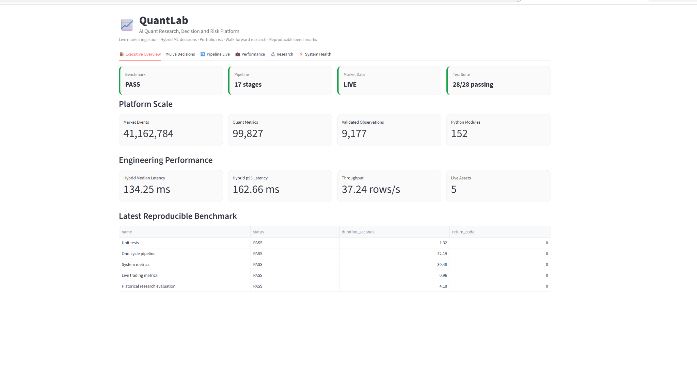

---

### Live AI Decisions

Real-time trading recommendations generated by the complete decision pipeline. Each recommendation includes the detected market regime, selected strategy, predicted return, model confidence and final decision.

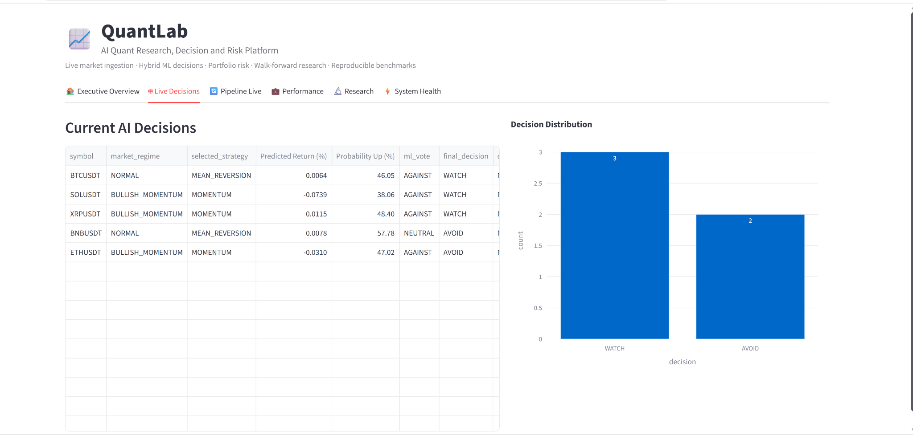

---

### Live Pipeline Execution

Every execution cycle is observable. The dashboard displays the complete 17-stage orchestration pipeline together with execution status and timing.

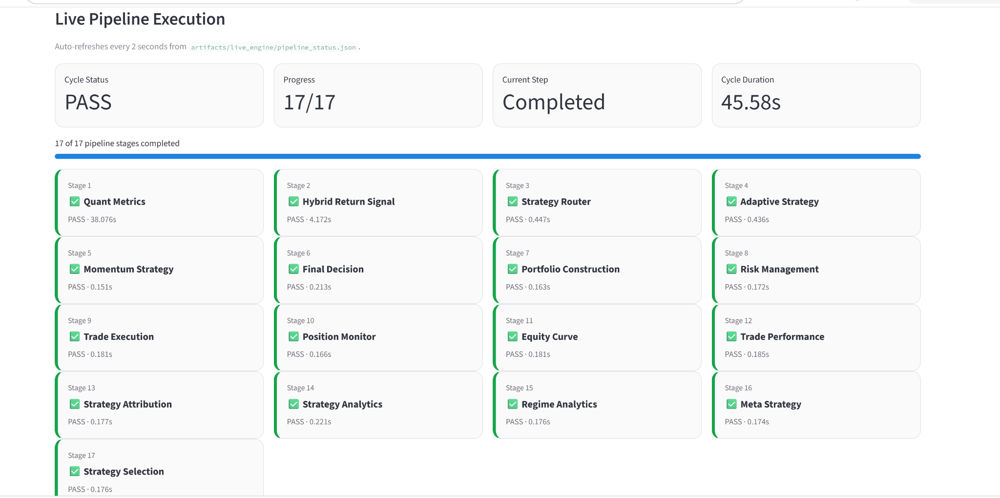

---

### Paper Trading Performance

Monitor paper-trading statistics, portfolio equity, cumulative PnL, open positions and execution metrics.

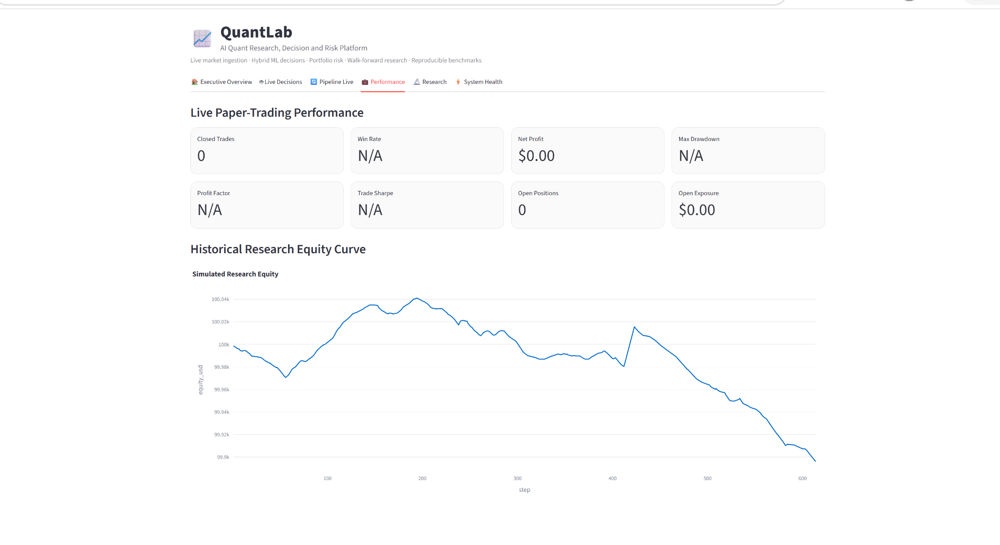

---

### Historical Research & Validation

Research tools include walk-forward validation, Monte Carlo simulation, drawdown analysis and historical trade analytics.

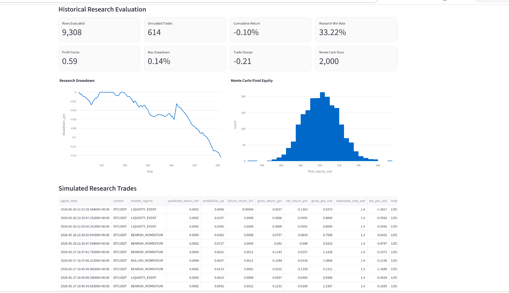

---

### System Health

Operational monitoring for inference latency, benchmark verification, data freshness, engineered features and platform health.

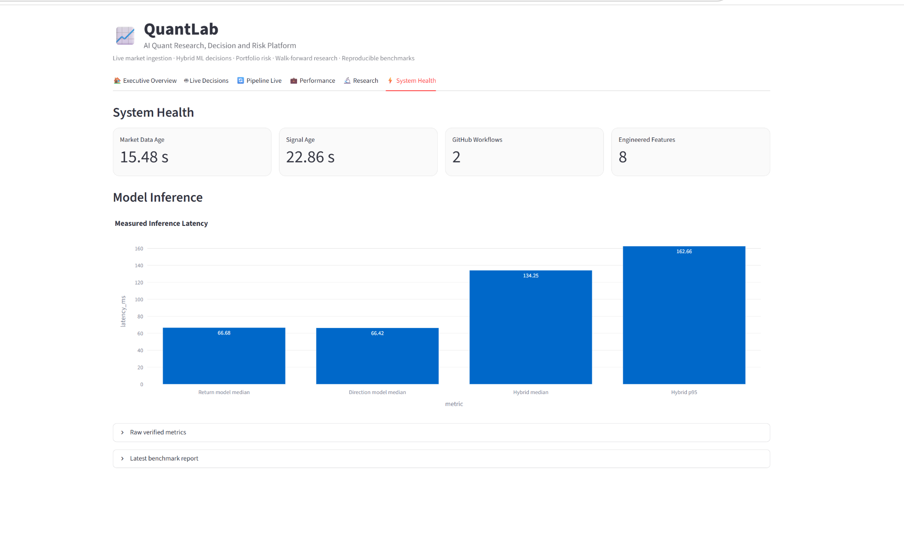


## Key Engineering Metrics

| Metric | Value |
|---------|------:|
| AI Pipeline Stages | 17 |
| Python Modules | 152 |
| Dashboard Pages | 6 |
| Unit Tests | 28 / 28 PASS |
| Live Assets | 5 |
| FastAPI Service | Included |
| Streamlit Dashboard | Production-ready |

---

## Highlights

-   End-to-end quantitative research platform
-   Real-time market data ingestion
-   Feature engineering & market regime detection
-   Machine-learning signal generation
-   Strategy routing & portfolio construction
-   Risk management & execution simulation
-   Position monitoring & performance attribution
-   Model registry & drift monitoring
-   FastAPI REST API
-   Streamlit dashboard
-   Docker-ready deployment

## Architecture

The following diagram summarizes the logical architecture implemented by QuantLab, from live market ingestion to AI-driven decisions, portfolio construction and monitoring.


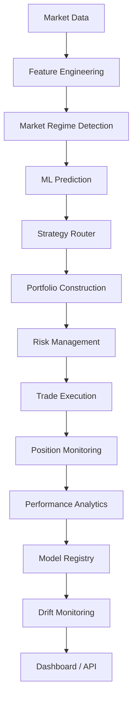

## Engineering Principles

-   Modular architecture
-   Deterministic decision pipeline
-   Explainable machine learning
-   Risk-first design
-   Production observability
-   Database-driven workflow
-   Separation of concerns

## Repository Overview

-   152 Python modules
-   FastAPI service
-   PostgreSQL persistence
-   Streamlit dashboard
-   Docker support
-   Production-oriented orchestration pipeline

## Why QuantLab

QuantLab was built to demonstrate how a production-grade quantitative
research platform can be structured. The project emphasizes engineering
discipline, modular architecture, reproducible ML workflows,
explainability, portfolio construction, risk management, monitoring, and
operational reliability rather than focusing solely on predictive
accuracy.

## Table of Contents

-   [Why QuantLab Exists](#why-quantlab-exists)
-   [What QuantLab Is / Is Not](#what-quantlab-is--is-not)
-   [Engineering Principles](#engineering-principles)
-   [System Architecture](#system-architecture)
-   [End-to-End Decision Pipeline](#end-to-end-decision-pipeline)
-   [Main Orchestration Pipeline](#main-orchestration-pipeline)
-   [Project Structure](#project-structure)
-   [Core Components](#core-components)
-   [Machine Learning Layer](#machine-learning-layer)
-   [Quantitative Research Layer](#quantitative-research-layer)
-   [Portfolio and Risk Layer](#portfolio-and-risk-layer)
-   [Production Interfaces](#production-interfaces)
-   [Monitoring and Model Lifecycle](#monitoring-and-model-lifecycle)
-   [Architecture Decisions](#architecture-decisions)
-   [Engineering Trade-offs](#engineering-trade-offs)
-   [Technologies](#technologies)
-   [Installation](#installation)
-   [Usage](#usage)
-   [API Examples](#api-examples)
-   [Screenshots](#screenshots)
-   [Current Limitations](#current-limitations)
-   [Productionization Roadmap](#productionization-roadmap)
-   [Why This Project Demonstrates Senior AI Engineering
    Skills](#why-this-project-demonstrates-senior-ai-engineering-skills)
-   [Technical Interview Guide](#technical-interview-guide)
-   [Disclaimer](#disclaimer)

------------------------------------------------------------------------

## Why QuantLab Exists

Financial markets are noisy, non-stationary, and difficult to model
reliably. A useful quantitative system cannot stop at predicting
returns. It must also answer engineering and research questions such as:

-   Which market regime is currently active?
-   Which strategy should be trusted under that regime?
-   Should a signal become a trade or be filtered out?
-   How much capital should be allocated to a position?
-   What risk constraints must be applied before execution?
-   Are live features drifting away from historical behavior?
-   Is the pipeline healthy enough to support downstream decisions?
-   Are trades, equity curves, strategy attribution, and validation
    results being tracked consistently?

QuantLab was built to explore these questions through a modular
architecture that combines quantitative research, machine learning,
portfolio engineering, risk controls, monitoring, and production-style
interfaces.

The main value of the project is not a single model or strategy. The
value is the architecture: a structured decision pipeline where
prediction, strategy selection, portfolio construction, risk management,
execution, analytics, and monitoring are separated into clear
engineering responsibilities.

------------------------------------------------------------------------

## What QuantLab Is / Is Not

### QuantLab is

-   A modular quantitative research platform.
-   A machine learning experimentation and decision pipeline.
-   A portfolio engineering and risk-aware paper trading system.
-   A production-oriented AI architecture project with API, dashboard,
    monitoring, and orchestration components.
-   A technical portfolio project designed to support architecture, ML
    engineering, MLOps, and quantitative research discussions.

### QuantLab is not

-   A guaranteed profitable trading system.
-   A high-frequency trading engine.
-   A brokerage or real-money execution platform.
-   Financial advice.
-   A fully production-hardened institutional trading platform.

This distinction is intentional. QuantLab is designed to demonstrate
system thinking, not to claim financial performance.

------------------------------------------------------------------------

## Engineering Principles

QuantLab follows a few simple engineering principles.

### 1. Prediction is not a decision

A model output should not automatically become a trade. QuantLab
separates prediction from strategy selection, portfolio allocation, risk
validation, and execution.

### 2. Every engine owns one responsibility

Each major component has a focused role: signal generation, routing,
portfolio construction, risk management, execution, monitoring, or
analytics. This makes the system easier to inspect, test, and extend.

### 3. Risk remains independent

Risk controls are not embedded inside the prediction layer. They are
applied after portfolio construction, which keeps allocation logic
separate from trade permission logic.

### 4. Models should be replaceable

The repository includes model registry, retraining, evaluation, and
champion-challenger components. These patterns allow models to evolve
without rewriting the full platform.

### 5. Every important decision should be observable

QuantLab writes intermediate outputs to database tables and exposes
selected results through API and dashboard interfaces. This makes the
decision pipeline easier to debug and explain.

### 6. Validation is continuous

The project includes walk-forward validation, forward validation, signal
tracking, trade performance, and attribution logic. The system is
designed around the idea that performance must be evaluated over time,
not only once during training.

### 7. Architecture should allow replacement, not rewrites

A new strategy, model, validator, or risk layer should be addable
without collapsing the rest of the system. This is why QuantLab favors
specialized engines and an explicit orchestration layer.

------------------------------------------------------------------------

## System Architecture

``` mermaid
flowchart TD
    subgraph DataLayer[Data Layer]
        A1[Live Market Trades]
        A2[OHLC Bars]
        A3[PostgreSQL Storage]
    end

    subgraph ResearchLayer[Research & Feature Layer]
        B1[Quant Metrics]
        B2[Momentum Features]
        B3[Cross-Asset Features]
        B4[Rolling Volatility]
        B5[Feature Importance]
    end

    subgraph AILayer[AI / ML Layer]
        C1[Return Prediction]
        C2[Direction Signal]
        C3[Signal Success Prediction]
        C4[Regime Prediction]
        C5[Ensemble Prediction]
        C6[Prediction Explanation]
    end

    subgraph DecisionLayer[Decision Layer]
        D1[Strategy Router]
        D2[Adaptive Strategy]
        D3[Momentum Strategy]
        D4[Final Strategy Decision]
        D5[Meta Strategy]
        D6[Strategy Selection]
    end

    subgraph PortfolioLayer[Portfolio & Risk Layer]
        E1[Portfolio Construction]
        E2[Risk Budgeting]
        E3[Position Sizing]
        E4[Risk Management]
    end

    subgraph ExecutionLayer[Execution & Analytics Layer]
        F1[Paper Trading]
        F2[Position Monitor]
        F3[Equity Curve]
        F4[Trade Performance]
        F5[Strategy Attribution]
        F6[Regime Analytics]
    end

    subgraph OpsLayer[Monitoring & Interfaces]
        G1[Model Registry]
        G2[Champion-Challenger]
        G3[Drift Monitor]
        G4[Model Health]
        G5[Pipeline Health]
        G6[FastAPI]
        G7[Streamlit Dashboard]
    end

    DataLayer --> ResearchLayer
    ResearchLayer --> AILayer
    AILayer --> DecisionLayer
    DecisionLayer --> PortfolioLayer
    PortfolioLayer --> ExecutionLayer
    ExecutionLayer --> OpsLayer
    OpsLayer --> DataLayer
```

The architecture is intentionally layered. Each layer answers a
different question:

  -----------------------------------------------------------------------
  Layer                               Question answered
  ----------------------------------- -----------------------------------
  Data Layer                          What market data is available?

  Research Layer                      What features and regimes can be
                                      derived?

  AI / ML Layer                       What do the models predict?

  Decision Layer                      Which strategy should be selected?

  Portfolio Layer                     How should capital be allocated?

  Risk Layer                          Should the trade be allowed?

  Execution Layer                     What paper trades were opened,
                                      closed, and tracked?

  Monitoring Layer                    Is the system reliable enough to
                                      trust?

  Interface Layer                     How can humans and services inspect
                                      outputs?
  -----------------------------------------------------------------------

------------------------------------------------------------------------

## End-to-End Decision Pipeline

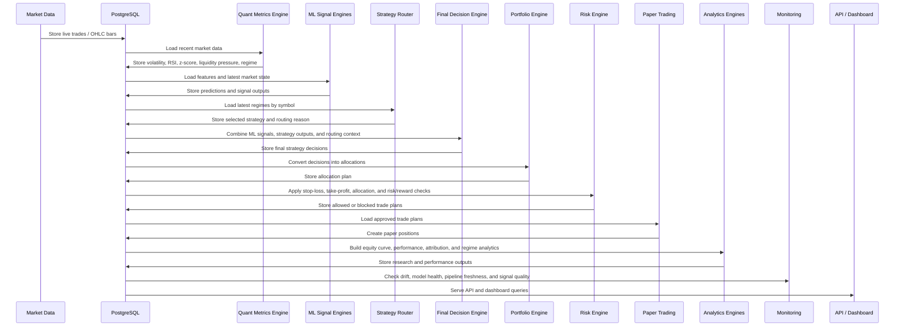

This flow reflects a core design choice: QuantLab does not treat machine
learning as the final decision-maker. ML outputs are one input into a
larger decision system.

------------------------------------------------------------------------

## Main Orchestration Pipeline

The main autonomous entry point is `ml/quantlab_orchestrator.py`. It
runs a fixed sequence of specialized engines every 60 seconds.

``` text
quant_metrics_engine.py
live_return_signal_engine.py
strategy_router.py
adaptive_strategy_engine.py
momentum_strategy_engine.py
final_strategy_decision_engine.py
portfolio_construction_engine.py
risk_management_v2.py
trade_execution_engine.py
position_monitor_engine.py
equity_curve_engine.py
trade_performance_engine.py
strategy_attribution_engine.py
strategy_analytics_engine.py
regime_analytics_engine.py
meta_strategy_engine.py
strategy_selection_engine.py
```

The orchestrator is deliberately simple. Its responsibility is not to
contain business logic. Its role is to coordinate the execution order
and make the pipeline explicit.

This makes the system easier to reason about during debugging and
technical review. A reviewer can inspect each stage independently and
follow the transformation from market data to final decisions, paper
positions, analytics, and monitoring outputs.

------------------------------------------------------------------------

## Project Structure

``` text
quantlab/
│
├── api/
│   └── main.py
│
├── ingestion/
│   └── quantlab_live_ingestion.py
│
├── ml/
│   ├── quantlab_orchestrator.py
│   ├── quant_metrics_engine.py
│   ├── live_return_signal_engine.py
│   ├── live_signal_engine.py
│   ├── live_direction_signal_engine.py
│   ├── live_signal_success_predictor.py
│   ├── strategy_router.py
│   ├── adaptive_strategy_engine.py
│   ├── momentum_strategy_engine.py
│   ├── final_strategy_decision_engine.py
│   ├── portfolio_construction_engine.py
│   ├── risk_management_v2.py
│   ├── trade_execution_engine.py
│   ├── position_monitor_engine.py
│   ├── equity_curve_engine.py
│   ├── trade_performance_engine.py
│   ├── strategy_attribution_engine.py
│   ├── model_registry.py
│   ├── champion_challenger_engine.py
│   ├── model_drift_monitor.py
│   ├── model_health_monitor.py
│   ├── pipeline_health_monitor.py
│   └── ...
│
├── quant_engine/
│   ├── cross_asset_feature_engine.py
│   └── rolling_volatility_engine.py
│
├── validation/
│   └── forward_validation_engine.py
│
├── quantlab_streamlit_dashboard.py
├── requirements.txt
├── Dockerfile
└── README.md
```

### Folder responsibilities

  -----------------------------------------------------------------------
  Folder                              Responsibility
  ----------------------------------- -----------------------------------
  `api/`                              FastAPI service exposing health,
                                      positions, signals, risk, equity,
                                      and dashboard data.

  `ingestion/`                        Market data ingestion logic.

  `ml/`                               Main platform engines: signals,
                                      strategies, portfolio, risk,
                                      execution, analytics, monitoring,
                                      model lifecycle.

  `quant_engine/`                     Quant-specific feature engineering
                                      components.

  `validation/`                       Forward validation logic.

  root files                          Dashboard, dependencies, Docker
                                      support, and repository
                                      configuration.
  -----------------------------------------------------------------------

------------------------------------------------------------------------

## Core Components

  -------------------------------------------------------------------------
  Component                             Role
  ------------------------------------- -----------------------------------
  `quantlab_orchestrator.py`            Runs the full autonomous pipeline
                                        as a sequence of specialized
                                        engines.

  `quant_metrics_engine.py`             Computes market metrics such as
                                        RSI, z-score, volatility, liquidity
                                        pressure, and market regime.

  `strategy_router.py`                  Selects a strategy based on the
                                        latest market regime for each
                                        symbol.

  `adaptive_strategy_engine.py`         Produces adaptive strategy outputs.

  `momentum_strategy_engine.py`         Produces momentum-oriented strategy
                                        outputs.

  `final_strategy_decision_engine.py`   Combines router output, strategy
                                        outputs, and ML predictions into
                                        final decisions.

  `portfolio_construction_engine.py`    Converts final decisions into
                                        allocation plans.

  `risk_management_v2.py`               Applies risk/reward and allocation
                                        constraints before allowing trades.

  `trade_execution_engine.py`           Opens paper positions for trade
                                        plans that pass risk checks.

  `position_monitor_engine.py`          Tracks open paper positions and
                                        their status over time.

  `equity_curve_engine.py`              Builds portfolio equity tracking
                                        from paper positions and market
                                        data.

  `trade_performance_engine.py`         Summarizes closed trade
                                        performance.

  `strategy_attribution_engine.py`      Attributes performance by strategy.

  `strategy_analytics_engine.py`        Produces strategy-level analytical
                                        summaries.

  `regime_analytics_engine.py`          Analyzes behavior by market regime.

  `meta_strategy_engine.py`             Adds a higher-level strategy
                                        analysis layer.

  `strategy_selection_engine.py`        Supports strategy selection logic.

  `model_registry.py`                   Stores model metadata and lifecycle
                                        information.

  `champion_challenger_engine.py`       Compares current and candidate
                                        models.

  `model_drift_monitor.py`              Compares live feature behavior with
                                        historical averages to flag drift.

  `model_health_monitor.py`             Combines registry, drift, and
                                        pipeline information into model
                                        health status.

  `pipeline_health_monitor.py`          Detects stale data, missing
                                        records, or insufficient
                                        OHLC/momentum history.

  `api/main.py`                         Exposes portfolio, signal,
                                        position, risk, performance, and
                                        health endpoints through FastAPI.

  `quantlab_streamlit_dashboard.py`     Provides a research dashboard for
                                        summaries, audit logs, feature
                                        importance, and validation results.
  -------------------------------------------------------------------------

------------------------------------------------------------------------

## Machine Learning Layer

QuantLab includes several ML-oriented workflows:

-   Return prediction
-   Directional signal prediction
-   Signal success prediction
-   Regime prediction
-   Ensemble prediction
-   Live prediction explanation
-   Model evaluation
-   Retraining scripts
-   Champion-challenger comparison
-   Model registry
-   Model drift and model health monitoring

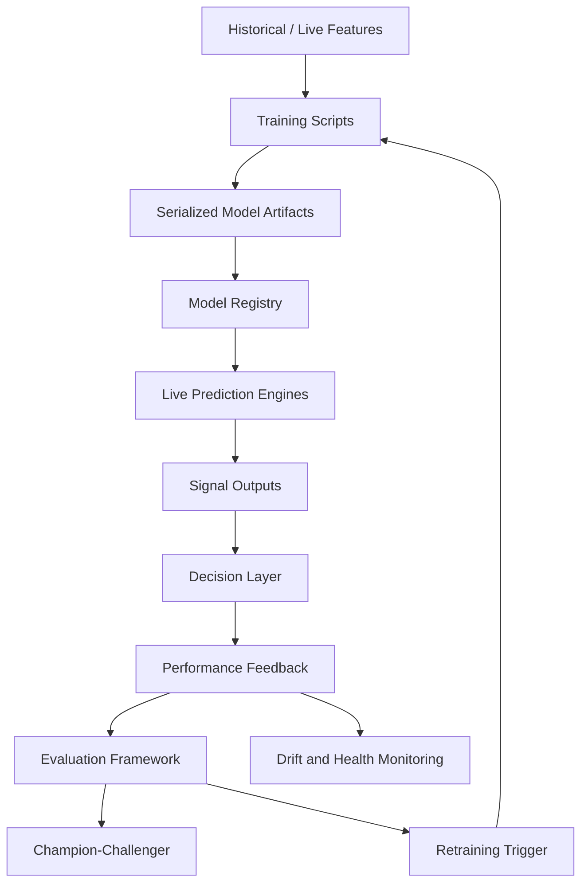

The key engineering idea is that model outputs are treated as inputs to
a decision pipeline, not as final actions. This design makes it possible
to evaluate models independently from trade execution and risk
management.

------------------------------------------------------------------------

## Quantitative Research Layer

QuantLab includes research components designed to evaluate strategy
behavior over time and across regimes:

-   Momentum features
-   Mean reversion optimization
-   Cross-asset ranking
-   Market regime filtering
-   Strategy diagnostics
-   Performance attribution
-   Walk-forward validation
-   Forward validation
-   Monte Carlo simulation
-   Worst-trade analysis
-   Signal profitability tracking
-   Signal accuracy tracking

The research layer is important because financial ML requires more than
an accuracy score. Signals must be evaluated after transaction costs,
slippage, risk controls, regime changes, and out-of-sample validation.

------------------------------------------------------------------------

## Portfolio and Risk Layer

QuantLab separates portfolio construction from risk management.

### Portfolio construction answers

-   Which assets should receive capital?
-   How much allocation should each decision receive?
-   How should exposure be distributed across selected opportunities?

### Risk management answers

-   Should this proposed trade be allowed?
-   Does the allocation exceed constraints?
-   What is the stop-loss level?
-   What is the take-profit level?
-   Is the risk/reward ratio acceptable?

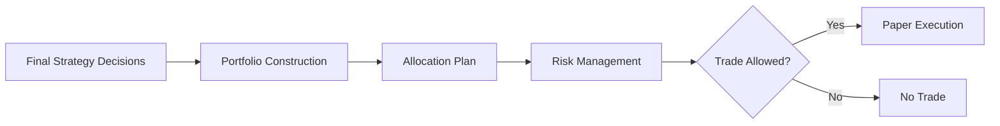

This separation matters because allocation and risk validation are
different engineering concerns. Keeping them independent makes the
system easier to test and extend.

------------------------------------------------------------------------

## Production Interfaces

### FastAPI service

`api/main.py` exposes operational endpoints for health, open positions,
portfolio equity, signals, performance, closed trades, risk exposure,
and dashboard summaries.

Example endpoints include:

``` text
GET /health
GET /positions/open
GET /portfolio/equity/latest
GET /signals/latest
GET /performance
GET /portfolio/closed
GET /risk/open-exposure
GET /dashboard
```

### Streamlit dashboard

`quantlab_streamlit_dashboard.py` provides an interactive dashboard for executive KPIs, research governance, feature explainability, walk-forward validation, threshold analysis, and model monitoring.

### Docker support

The repository includes a Dockerfile, which supports reproducibility and
makes the project easier to run in a controlled environment.

------------------------------------------------------------------------

## Monitoring and Model Lifecycle

QuantLab includes monitoring and model lifecycle components that reflect
MLOps-style thinking:

  -----------------------------------------------------------------------
  Concern                             Component
  ----------------------------------- -----------------------------------
  Model metadata                      `model_registry.py`

  Candidate model comparison          `champion_challenger_engine.py`

  Drift detection                     `model_drift_monitor.py`

  Model-level health                  `model_health_monitor.py`

  Pipeline freshness                  `pipeline_health_monitor.py`

  Signal quality                      `signal_accuracy_tracker.py`,
                                      `signal_profitability_tracker.py`

  Trade outcomes                      `trade_performance_engine.py`

  Strategy outcomes                   `strategy_attribution_engine.py`,
                                      `strategy_analytics_engine.py`
  -----------------------------------------------------------------------

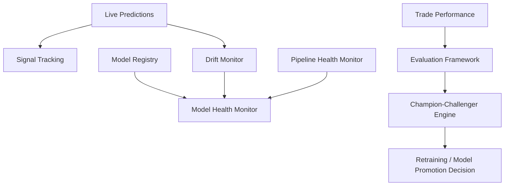

The current implementation is a research/portfolio version of these
concepts, not a full enterprise MLOps platform. The architecture is
nevertheless designed around the correct separation of responsibilities.

------------------------------------------------------------------------

## Architecture Decisions

### ADR-001 — Use a central orchestrator

**Context:** The system contains many specialized engines. Without a
clear execution layer, the pipeline would be difficult to reproduce and
debug.

**Decision:** Use `quantlab_orchestrator.py` as the main entry point
that runs engines in a defined order.

**Consequences:**

-   Clear execution order.
-   Easier debugging.
-   Easy to add or remove stages.
-   More orchestration complexity than a single script.

### ADR-002 — Separate prediction from decision-making

**Context:** A predicted return is not automatically a valid trade.

**Decision:** Keep ML prediction engines separate from strategy routing,
final decision-making, portfolio construction, and risk management.

**Consequences:**

-   Easier to evaluate model quality independently.
-   Easier to add risk and strategy context.
-   Requires more pipeline stages.

### ADR-003 — Use a strategy router

**Context:** Markets behave differently across regimes. A single static
strategy is unlikely to be appropriate in every environment.

**Decision:** Introduce a strategy router that maps market regimes to
strategy choices.

**Consequences:**

-   Strategy selection becomes explicit.
-   New strategies can be added more cleanly.
-   Routing logic must be maintained and validated.

### ADR-004 — Separate portfolio construction from risk management

**Context:** Allocation and risk permission are related but not
identical problems.

**Decision:** Let portfolio construction create allocations, then let
the risk layer approve or block trade plans.

**Consequences:**

-   Clearer separation of concerns.
-   Easier to test risk logic independently.
-   Longer execution pipeline.

### ADR-005 — Add model registry and champion-challenger concepts

**Context:** Models should not be replaced blindly.

**Decision:** Include registry and champion-challenger components to
support model lifecycle management.

**Consequences:**

-   Better model traceability.
-   Safer model evolution.
-   Requires metrics, metadata, and comparison logic.

### ADR-006 — Monitor both models and pipeline health

**Context:** Model performance is meaningless if data is stale,
incomplete, or the pipeline is broken.

**Decision:** Include drift, model health, and pipeline health monitors.

**Consequences:**

-   Better operational visibility.
-   Easier debugging.
-   Additional monitoring code to maintain.

------------------------------------------------------------------------

## Engineering Trade-offs

  -----------------------------------------------------------------------
  Decision                Benefit                 Cost
  ----------------------- ----------------------- -----------------------
  Modular engines         Easier maintenance,     More files and
                          testing, and            orchestration overhead
                          replacement             

  Central orchestrator    Clear execution order   Less flexible than
                                                  event-driven
                                                  orchestration

  PostgreSQL persistence  Inspectable             Requires database setup
                          intermediate state      

  Strategy router         Explicit regime-aware   Routing logic must be
                          strategy choice         validated

  Separate risk layer     Cleaner risk controls   Adds another pipeline
                                                  stage

  Champion-challenger     Safer model evolution   Requires evaluation
                                                  infrastructure

  Drift and health        Better observability    More operational
  monitoring                                      complexity

  API + dashboard         Human and service       More interfaces to
                          access to outputs       maintain
  -----------------------------------------------------------------------

These trade-offs are intentional. QuantLab favors clarity,
inspectability, and modularity over minimal code size.

------------------------------------------------------------------------

## Technologies

  -----------------------------------------------------------------------
  Area                                Tools / Concepts
  ----------------------------------- -----------------------------------
  Language                            Python

  API                                 FastAPI

  Dashboard                           Streamlit, Plotly

  Database                            PostgreSQL

  Data Processing                     pandas, SQL

  Machine Learning                    scikit-learn-style workflows,
                                      serialized models

  Quant Research                      Momentum, regime detection, risk
                                      budgeting, walk-forward validation

  Monitoring                          Drift monitoring, model health
                                      monitoring, pipeline health
                                      monitoring

  Deployment                          Docker
  -----------------------------------------------------------------------

------------------------------------------------------------------------

## Installation

``` bash
git clone https://github.com/xavi092000/QuantLab.git
cd QuantLab

python -m venv venv
source venv/bin/activate     # macOS/Linux
# or
venv\Scripts\activate        # Windows

pip install -r requirements.txt
```

> Note: QuantLab expects a local PostgreSQL database named `quantlab`.
> Before publishing or deploying the project, move database credentials
> to environment variables and provide a `.env.example` file.

------------------------------------------------------------------------

## Usage

Run the FastAPI service:

``` bash
uvicorn api.main:app --reload
```

Run the Streamlit dashboard:

``` bash
streamlit run quantlab_streamlit_dashboard.py
```

Run the autonomous pipeline:

``` bash
python ml/quantlab_orchestrator.py
```

------------------------------------------------------------------------

## API Examples

Once the API is running, FastAPI provides interactive documentation at:

``` text
http://localhost:8000/docs
```

Example endpoints:

``` text
GET /health
GET /positions/open
GET /portfolio/equity/latest
GET /signals/latest
GET /performance
GET /portfolio/closed
GET /risk/open-exposure
GET /dashboard
```

------------------------------------------------------------------------

## Screenshots

### Executive Overview


---

### Live AI Decisions


---

### Live Pipeline Execution


---

### Paper Trading Performance


---

### Historical Research & Validation


---

### System Health


## Current Limitations

QuantLab is a portfolio and research engineering project, not a
production trading system.

Current limitations include:

-   No real-money execution layer.
-   No financial performance guarantee.
-   Model artifacts should be excluded from GitHub and managed through
    an artifact store or model registry.
-   Broader integration and failure-mode coverage would be required before production use.
-   Data source assumptions should be documented more explicitly.
-   Public sample data is not yet packaged for reproducible demos.
-   The orchestrator currently runs sequential scripts rather than an
    event-driven workflow engine.

------------------------------------------------------------------------

## Productionization Roadmap

### Phase 1 — Repository hardening

-   [x] Centralize database configuration and remove secrets from source code.
-   [x] Add GitHub Actions workflows.
-   [x] Add automated unit tests for core engines.
-   [x] Add reproducible benchmark and system-metrics tooling.
-   [x] Add live dashboard screenshots and a platform demonstration.
-   [ ] Expand database integration and failure-recovery tests.
-   [ ] Package a lightweight public demo dataset.

### Phase 2 — MLOps maturity

-   Add experiment tracking.
-   Add model cards.
-   Add model artifact storage.
-   Add data versioning.
-   Add feature validation.
-   Add structured logging.
-   Add monitoring dashboards.

### Phase 3 — Production architecture evolution

-   Replace sequential orchestration with workflow orchestration or
    event-driven architecture.
-   Add Kafka or another streaming layer for live market events.
-   Add MLflow or equivalent model lifecycle tooling.
-   Add a feature store.
-   Add cloud deployment documentation.
-   Add Kubernetes deployment manifests.
-   Add shadow deployment for candidate models.

These are future improvements, not claims about the current
implementation.

------------------------------------------------------------------------

## Why This Project Demonstrates Senior AI Engineering Skills

  -----------------------------------------------------------------------
  Competency                          Evidence in the Repository
  ----------------------------------- -----------------------------------
  AI Engineering                      Multiple signal engines, return
                                      prediction, direction prediction,
                                      regime prediction, signal success
                                      prediction, ensemble logic.

  ML Engineering                      Training scripts, retraining
                                      scripts, evaluation framework,
                                      model registry, champion-challenger
                                      comparison.

  MLOps Awareness                     Drift monitoring, model health
                                      monitoring, retraining triggers,
                                      pipeline health checks.

  Quantitative Research               Momentum logic, regime analytics,
                                      walk-forward validation, strategy
                                      attribution, performance analysis.

  Software Architecture               Modular engines, orchestrated
                                      pipeline, separation between
                                      prediction, strategy, portfolio,
                                      risk, and execution.

  Production Thinking                 FastAPI service, Streamlit
                                      dashboard, Dockerfile, PostgreSQL
                                      persistence, monitoring tables.

  Risk Awareness                      Risk budgeting, risk management,
                                      position sizing,
                                      stop-loss/take-profit planning,
                                      transaction cost and slippage
                                      modules.

  Technical Communication             The repository is documented as a
                                      system, not as a collection of
                                      scripts.
  -----------------------------------------------------------------------

The strongest signal in this repository is architectural maturity: the
project does not rely on a single impressive model. It demonstrates how
a complex AI decision system can be decomposed into explainable,
replaceable, and monitorable components.

------------------------------------------------------------------------

## Technical Interview Guide

This repository is designed to support technical discussions around the
following topics:

  --------------------------------------------------------------------------------------
  Interview Topic         Relevant Files                         Discussion Angle
  ----------------------- -------------------------------------- -----------------------
  System architecture     `quantlab_orchestrator.py`             Why a central
                                                                 orchestrator
                                                                 coordinates specialized
                                                                 engines.

  Separation of concerns  `final_strategy_decision_engine.py`,   Why prediction,
                          `portfolio_construction_engine.py`,    decision, allocation,
                          `risk_management_v2.py`                and risk are separate.

  Strategy routing        `strategy_router.py`                   Why market regimes
                                                                 influence strategy
                                                                 selection.

  Model lifecycle         `model_registry.py`,                   How models can be
                          `champion_challenger_engine.py`        compared and evolved
                                                                 safely.

  Model monitoring        `model_drift_monitor.py`,              How live behavior can
                          `model_health_monitor.py`              diverge from historical
                                                                 behavior.

  Pipeline reliability    `pipeline_health_monitor.py`           Why data freshness and
                                                                 pipeline state matter.

  Time-series validation  `walk_forward_validation.py`,          Why random splits are
                          `forward_validation_engine.py`         often inappropriate for
                                                                 market data.

  Risk controls           `risk_management_v2.py`,               Why risk is independent
                          `risk_budgeting_engine.py`,            from signal generation.
                          `position_sizing_engine.py`            

  API design              `api/main.py`                          How portfolio, signal,
                                                                 performance, and risk
                                                                 outputs are exposed.

  Dashboarding            `quantlab_streamlit_dashboard.py`      How research and
                                                                 validation outputs are
                                                                 made inspectable.
  --------------------------------------------------------------------------------------

### Example discussion prompts

-   Why should a prediction not directly become a trade?
-   Why did you separate portfolio construction from risk management?
-   How would you detect model drift in a live market system?
-   What would be required to make this production-ready?
-   How would you test this system end to end?
-   How would you replace the sequential orchestrator with an
    event-driven architecture?
-   How would you evaluate whether a challenger model should replace the
    champion model?

------------------------------------------------------------------------

## Disclaimer

This project is for educational, research, and portfolio purposes only.
It does not provide financial advice and should not be used for
real-money trading without significant additional validation, security
hardening, compliance review, risk controls, and infrastructure work.

------------------------------------------------------------------------

## Conclusion

QuantLab demonstrates how machine learning, quantitative research, risk
management, monitoring, and production-oriented software design can be
combined into a modular trading intelligence platform.

Its main contribution is architectural: it treats data ingestion, feature engineering, prediction, strategy routing, portfolio construction, risk management, paper execution, validation, analytics, monitoring and interface design as independent but connected engineering responsibilities.

**QuantLab demonstrates how modern AI engineering, quantitative research, MLOps concepts and production software architecture can be combined into a modular decision platform designed for reliability, observability and continuous experimentation.**

## Future Work

-   Reinforcement Learning strategies
-   Multi-asset portfolio optimization
-   Live broker integrations
-   Kubernetes deployment
-   Distributed inference
-   Event-driven architecture
